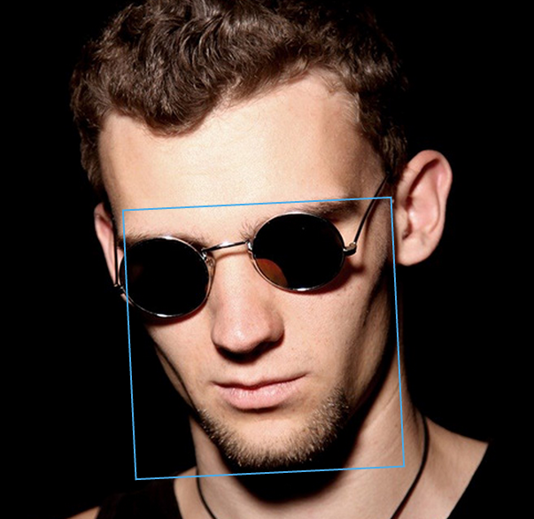
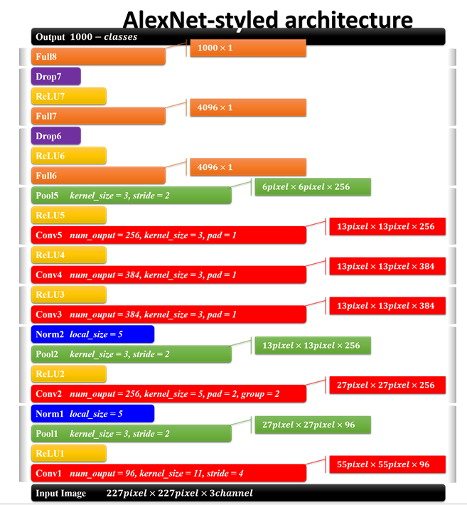

# 人脸检测项目实战

## 目的：检测到人脸框

### 数据

数据获取：

- Benchmark是一个行业的基准（数据库，论文，源码，结果）。

- 优秀论文，通常实验阶段都会介绍它所使用的数据集，公开数据集可以下载。申请数据集的时候，最好使用学校的邮箱。

- 论坛或者交流社区，比如thinkface

- 数据的规模 越大越好 今天的数据量4W多

二分类数据，第一类人脸，第二类非人脸

- 人脸数据：路径/xxx.jpg  60,80,280,320

- 非人脸数据：只要不是人脸都是可以的

对于正样本：

- 裁剪的操作，根据标注的坐标把人脸裁剪出来。可以opencv这个工具，来完成制作人脸数据。要检查一下，看一看数据有没有问题。

对于负样本：

- 进行一个随机的裁剪，IOU这个比例（重叠的比例）在原始的数据当中，IOU < 0.3 认为是一个负样本，最好是拿没有人脸数据的当作负样本。

制作LMDB数据源（其实它就是caffe支持的非常常用的分类的数据源）

写两个txt文档文件

Train.txt

- 0/xxx.jpg 0

- 1/xxx.jpg 1

Val.txt

- xxx.jpg 0

- xxx.jpg 1

制作LMDB数据源，用caffe提供的脚本文件

前几行改成自己的安装目录

要进行一个 resize 操作，比如 ALEXNET 或者 VGG 通常都是给它 resize `227*227`.

Sh LMDB脚本文件。文件是很大的

### 训练ALEXNET网络

把最后一层全连接改成你要分类的类别个数（人脸检测来说就是2）

### Solver文件

- test_iter: 一次测试，要测试多少个batch。最好让 `test_iter * batch_size= 测试集中样本总个数`

- base_lr: 基础的学习率，太重要了，不能太大

网络训练的速度跟什么最相关？

- 网络的模型大小，网络越大速度越慢。
- 数据输入的大小，`227*227` 和 `32*32` 的，可能要慢几百倍。输入越大，网络越慢。

### 人脸代码：

多尺度的人脸检测

- model转换成全卷积

- 多个scale

- 前向传播，得到特征图，概率值矩阵

- 反变换，映射到原图上的坐标值

- NMS非极大值抑制

问题：速度太慢了，因为做了多个scale，每个scale都要进行一次前向传播。

解决：采取级联的网络，再加上矫正网络。